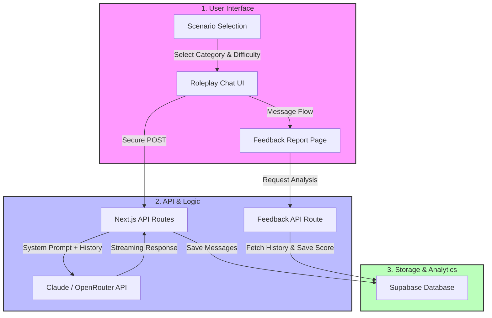

# 🤖 AI Roleplay Job Simulator: High-Fidelity Professional Training Platform
*(AI 기반 직무 롤플레이 시뮬레이터: 데이터 기반 피드백 및 역량 평가 시스템)*

[](https://nextjs.org/)
[](https://tailwindcss.com/)
[](https://openrouter.ai/)
[](https://supabase.com/)
[](https://vercel.com/)
[](https://jobsimulatorai.baseis.net/)

This repository contains the full-stack implementation of the **AI Roleplay Job Simulator**, an innovative educational platform designed to bridge the gap between theoretical knowledge and practical application. Users can practice real-world scenarios (Customer Support, Sales, Interviews) with highly constrained AI personas and receive automated, data-driven competency evaluations.

Developed as an MVP for the HighVibe Coding Competition (KIT).

---

## 🚀 Executive Summary (TL;DR)
- **The Challenge**: Traditional vocational training lacks scalable, realistic environments for practicing soft skills and high-stress professional conversations.
- **The Solution**: A Next.js-based web application that leverages Advanced LLMs (Claude/Gemini) to simulate specific customer, interviewer, and client personas with strict "Role-Lock" constraints.
- **The Impact**: 
  - **Zero Human Cost**: Eliminates the need for expensive human interlocutors for mock interviews and roleplays.
  - **Instant Feedback**: Reduces evaluation turnaround time from days to **under 5 seconds** post-session.
  - **Production-Ready**: Secure server-side API routing prevents API key leakage and ensures data integrity.

---

## 📌 1. Problem Definition (문제 정의)
- **Pain Point**: Job seekers and students often struggle with "unstructured" scenarios in real-world jobs (angry customers, aggressive negotiation, behavioral interviews). Mock interviews with humans are costly, hard to schedule, and difficult to standardize.
- **Vision**: To create a "Flight Simulator" for professional skills. By using strict system prompting, the AI becomes a non-cooperative or challenging counterpart, forcing the user to apply best practices in communication and problem-solving.

---

## 🛠️ 2. System Architecture & Workflow (시스템 아키텍처)
The system is designed to separate the client-side UI from the secure API interactions and database storage, ensuring high performance and data integrity.



---

## 🧠 3. Key Features & Technical Depth (핵심 기능 및 기술적 깊이)

### 1. Multi-Dimensional Persona Matrix (다면적 페르소나 매트릭스)
The system offers a 3x3 matrix of scenarios to cover a wide range of difficulty and domains:
- **Customer Support (고객응대)**: From simple shipping delays to aggressive VIP contract cancellations.
- **Interview (면접)**: From basic HR questions to deep technical grills and executive business case evaluations.
- **Sales (세일즈)**: From small-scale product pitches to high-stakes B2B negotiations with strict ROI demands.

### 2. Strict "Role-Lock" Mechanism (역할 고정 메커니즘)
To ensure educational value, the AI is constrained by strict **Negative Constraints (부정적 제약 조건)**:
- **Zero Breakout**: The AI will not break character to help the user, even if asked directly.
- **Dynamic Emotional Curves**: AI mood changes dynamically based on the user's responses (e.g., de-escalation of anger when empathy is shown).
- **Technical Implementation**: Zero-shot prompting with explicit boundary definitions in `lib/personas.ts`.

### 3. Automated Competency Evaluation (자동 역량 평가)
Upon completion, the conversation is parsed by a dedicated "Coach" LLM to generate:
- **Quantitative Scores**: Total Score, Empathy, Problem Solving, and Communication (0-100).
- **Qualitative Feedback**: Bullet points of "Strengths" and "Areas for Improvement".
- **JSON Parsing**: Strictly enforces valid JSON output from the LLM for reliable UI rendering.

---

## 📊 4. Expected Impact & Performance
- **Scalability**: Can support thousands of concurrent practice sessions without human intervention.
- **Consistency**: Guarantees 100% consistent evaluation criteria based on the defined coach prompt, eliminating human bias.
- **Latency**: Optimized streaming responses for the chat interface, ensuring a natural conversation flow.

---

## 💻 5. Tech Stack (기술 스택)
- **Frontend**: Next.js 14 (App Router) for optimized SSR and routing.
- **Styling**: Tailwind CSS for a clean, responsive interface.
- **AI Integration**: Claude API (via Anthropic or OpenRouter) for high-fidelity roleplay; Gemini/OpenAI for structured feedback generation.
- **Backend/DB**: Supabase for real-time session storage and tracking.
- **Hosting**: Vercel for fast edge deployment.

---

## 🔗 6. Live Implementation
The project is deployed and accessible at:
👉 **[AI Roleplay Job Simulator Live Demo](https://jobsimulatorai.baseis.net/)**

---

## 📁 7. Repository Structure
```text
jobsimulator/
├── app/                  # Next.js App Router Pages & APIs
│   ├── api/chat/        # Claude Roleplay API
│   ├── api/feedback/    # Automated Coaching Report API
│   ├── dashboard/       # Instructor Dashboard (Future)
│   ├── feedback/        # Results Visualization
│   └── roleplay/        # Chat Interface
├── lib/                  # Utilities & Configurations
│   ├── personas.ts      # Prompt Engineering & Persona Definitions
│   └── supabase.ts      # Database Client
└── public/               # Static Assets
```

---

## ⚙️ 8. Getting Started (Local Setup)
To run this project locally, follow these steps:

1. Clone the repository:
   ```bash
   git clone https://github.com/junhyung-L/jobsimulator
   cd jobsimulator
   ```
2. Install dependencies:
   ```bash
   npm install
   ```
3. Set up environment variables:
   Create a `.env.local` file in the root directory and add:
   ```env
   OPENROUTER_API_KEY=your_key_here
   NEXT_PUBLIC_SUPABASE_URL=your_url_here
   NEXT_PUBLIC_SUPABASE_ANON_KEY=your_key_here
   ```
4. Run the development server:
   ```bash
   npm run dev
   ```

---
*Refactored and polished to meet professional software engineering standards for the [Data Analyst Portfolio](https://github.com/junhyung-L/Resume/blob/main/Portfolio/README.md).*
